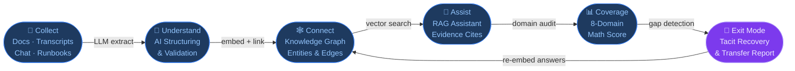
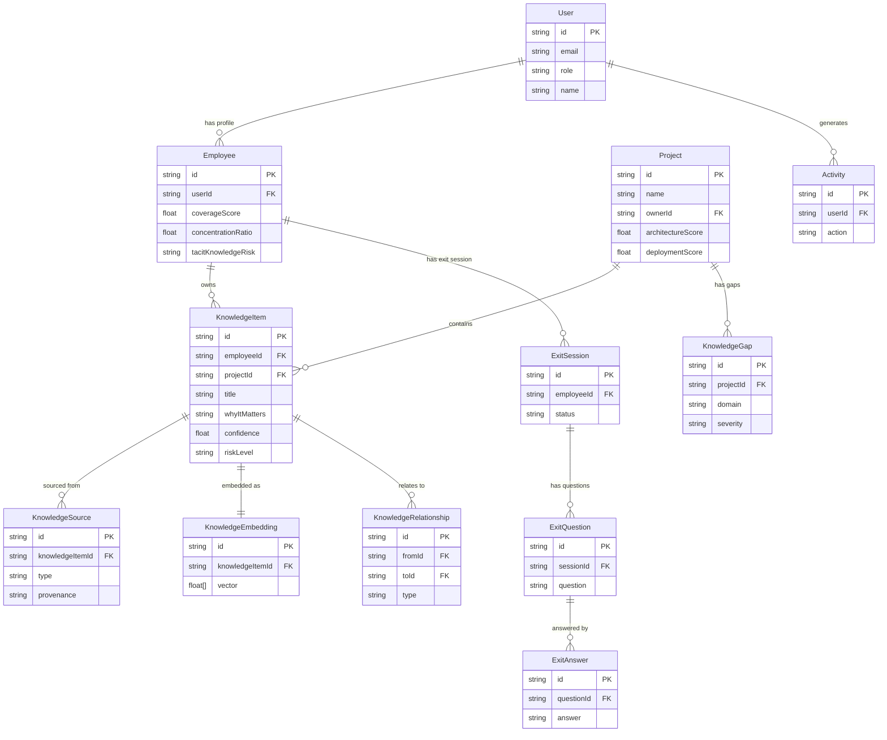

# KnowledgeVault AI 🧠
### AI Knowledge Continuity & Organizational Memory System

> **Tagline**: *"Turn employee experience into a living, searchable organizational memory."*

---

## 📌 Executive Overview

Critical organizational knowledge often lives inside employees' heads, old chats, incident post-mortems, emails, documents, meeting discussions, code comments, and undocumented workflows. When experienced staff leave, organizations suffer acute brain drain, and successors spend months rebuilding context.

**KnowledgeVault AI** is a production-grade enterprise platform that continuously converts scattered employee experience into a structured, searchable, connected, evidence-backed organizational memory.

### The Core Product Differentiator
Unlike static wikis or standard document search tools, KnowledgeVault AI captures:
- **Not just what** the company knows, but **why it matters**.
- **Where it came from** (complete source traceability and exact citations).
- **How reliable it is** (confidence rating & last verified audit date).
- **What it connects to** (interactive multi-entity Knowledge Graph).
- **What knowledge is still missing** (dynamic Knowledge Gap detection).
- **Active recovery before departure** (Flagship **Employee Exit Mode**).
- **Git & Repository Mining** (Continuously extracts coding style, debugging patterns, and PR decision rationale from commit diffs).

---

## 🚀 The Core Product Workflow

```
COLLECT ──► UNDERSTAND ──► CONNECT ──► ASSIST ──► COVERAGE ──► EXIT MODE
 (Docs,       (AI Structuring   (Knowledge Graph  (RAG Assistant    (Mathematical     (Interactive
 Transcripts,  & Validation)     Entities &        Evidence Cites)   8-Domain Score)   Knowledge Transfer
 Chat, Runbooks)                 Dependencies)                                          & Recovery)
```



---

## 🛠️ Tech Stack & Architecture

- **Frontend**: Next.js 15+ (App Router), React 19, TypeScript, Tailwind CSS, Framer Motion, Lucide Icons, Recharts, `@xyflow/react` (React Flow) for interactive Knowledge Graph visualization.
- **Backend**: Next.js App Router Server Endpoints & Server Actions.
- **Database & ORM**: PostgreSQL / SQLite via Prisma ORM.
- **Vector & Embeddings**: Clean vector-storage abstraction with normalized float cosine similarity search. Embeddings generated via OpenAI Embedding API or local deterministic semantic n-gram vectorizer.
- **AI & RAG Engine**: OpenAI-compatible LLM abstraction (`OPENAI_API_KEY`, configurable model via `LLM_MODEL`) with intelligent local heuristic fallback engine ensuring 100% offline and demo reliability without third-party failures.
- **Document Processing**: Real file ingestion supporting **PDF** (`pdf-parse`), **DOCX** (`mammoth`), **Markdown**, **TXT**, **JSON**, and **CSV**.

```mermaid
block-beta
  columns 3

  block:frontend["🖥️ Frontend Layer"]:
    columns 1
    FE1["Next.js 15 App Router"]
    FE2["React 19 + TypeScript"]
    FE3["Tailwind + Framer Motion"]
    FE4["React Flow (Knowledge Graph)"]
    FE5["Recharts (Coverage Dashboard)"]
  end

  block:backend["⚙️ Backend / API Layer"]:
    columns 1
    BE1["Next.js Server Actions"]
    BE2["REST API Routes /api/**"]
    BE3["Prisma ORM"]
    BE4["RBAC Middleware"]
    BE5["Document Parser"]
  end

  block:ai["🤖 AI & Data Layer"]:
    columns 1
    AI1["OpenAI LLM (GPT-4o-mini)"]
    AI2["Embedding Model"]
    AI3["Cosine Similarity Search"]
    AI4["Heuristic Fallback Engine"]
    AI5["SQLite / PostgreSQL"]
  end

  frontend --> backend
  backend --> ai
```

---

## 🏢 Demo Persona & Evaluation Credentials

KnowledgeVault AI comes pre-seeded with realistic enterprise data from **NovaTech Systems**. Four pre-configured roles are available on `/login`:

| Role | Name | Title | Primary Responsibility |
| :--- | :--- | :--- | :--- |
| **ADMIN** | Admin User (`admin@novatech.ai`) | VP of Engineering | Full system governance, AI configuration, knowledge verification. |
| **MANAGER** | Sarah Chen (`manager@novatech.ai`) | Engineering Manager | Team coverage monitoring, gap resolution, exit mode oversight. |
| **EMPLOYEE** | Rahul Sharma (`rahul@novatech.ai`) | Senior Backend Architect | Core payment engineer holding 73% tacit operational knowledge. |
| **NEW_EMPLOYEE**| Alex Rivera (`newhire@novatech.ai`) | Associate Engineer | Context rebuild mode, querying AI runbooks with citations. |

---

## ⚡ Primary Hackathon Demo Walkthrough

1. **Dashboard (`/dashboard`)**:
   - Observe **54% overall knowledge coverage**.
   - Notice **Rahul Sharma** holds a critical **73% knowledge concentration** in the Payment System.
   - Review category coverage: Architecture (90%), Deployment (70%), Troubleshooting (50%), Business Rules (40%), Edge Cases (20%).
2. **Knowledge Graph (`/graph`)**:
   - Inspect interactive nodes: `Rahul Sharma` ──► `Payment System` ──► `Java / Spring Boot` ──► `Payment Deployment` ──► `Timeout Issue` ──► `Solution`.
   - Click any node to open the live entity detail side-panel.
3. **RAG AI Assistant (`/assistant`)**:
   - Ask: *"How do I deploy the payment service?"*
   - Verify the assistant responds with **Recommended Action**, **Why**, **Relevant Context**, and **Cited Sources** (`Payment Deployment Review - March 12`).
4. **Knowledge Gaps (`/gaps`)**:
   - Notice open critical gaps: *Payment Failure Recovery & Failover Handling*.
   - Click **Generate AI Questions** to dynamically synthesize gap-filling technical prompts.
5. **Employee Exit Mode (`/exit-mode`) — THE KILLER FEATURE**:
   - Select **Rahul Sharma**.
   - Review **Already Documented** vs **Missing Tacit Experience**.
   - The AI asks targeted technical questions regarding production failovers.
   - Click a quick demo answer (e.g. *Peak Billing Timeout & Envoy 8500ms* or *Adyen CLI switchover*).
   - Watch the LLM process the answer in real-time, generate embeddings, and link the new item to the graph.
   - Watch **Coverage jump from 54% to 78%**!
   - Click **Export Report JSON** or **Print** for the *Exit Knowledge Transfer Report*.

---

## 💻 Getting Started

### Prerequisites

| Tool | Version | Notes |
| :--- | :--- | :--- |
| Node.js | v18 / v20 / v22 / v24 | LTS recommended |
| npm | v9+ | Bundled with Node.js |
| Git | any recent | For cloning |

> **No external database required.** KnowledgeVault AI uses **SQLite** by default — zero installation needed for local development.

---

### ⚡ Quick Start (copy-paste-run)

```bash
# 1. Clone the repository
git clone https://github.com/Anushka5442001/KnowledgeVault-AI
cd KnowledgeVault-AI

# 2. Install all dependencies
npm install

# 3. Set up environment variables
#    (copy the example file; safe defaults work out-of-the-box)
cp .env.example .env

# 4. Push Prisma schema → creates prisma/dev.db (SQLite)
npm run db:push

# 5. Seed the database with the NovaTech demo dataset
npm run db:seed

# 6. (Optional) Run the automated test suite
npm test

# 7. Start the development server
npm run dev
```

✅ Open **[http://localhost:3000](http://localhost:3000)** in your browser.  
🔐 Log in with any of the [demo credentials](#-demo-persona--evaluation-credentials) listed below.

---

### 📋 Step-by-Step Breakdown

#### Step 1 — Clone & enter the project
```bash
git clone https://github.com/Anushka5442001/KnowledgeVault-AI
cd KnowledgeVault-AI
```

#### Step 2 — Install dependencies
```bash
npm install
```
This installs Next.js 15, Prisma, React 19, Framer Motion, React Flow, and all other declared packages.

#### Step 3 — Configure environment
```bash
cp .env.example .env
```
The `.env.example` file ships with safe defaults. The application is fully functional **without** an OpenAI key — the built-in deterministic heuristic fallback engine handles all AI responses.

To unlock GPT-powered responses, add your key:
```ini
OPENAI_API_KEY="sk-..."
```

#### Step 4 — Initialize the database
```bash
npm run db:push
```
Runs `prisma db push` which creates `prisma/dev.db` (SQLite) and syncs the full schema (Users, Employees, Projects, KnowledgeItems, Embeddings, Graph Relationships, Exit Sessions, etc.).

#### Step 5 — Seed demo data
```bash
npm run db:seed
```
Populates the database with the **NovaTech Systems** enterprise scenario: 4 users, 3 projects, 20+ knowledge items, pre-built graph relationships, knowledge gaps, and a realistic coverage score of 54%.

#### Step 6 — Run tests _(optional but recommended)_
```bash
npm test
```
Executes the Node.js test suite validating the embedding pipeline, cosine similarity, coverage math, gap detection, and exit-mode session logic.

#### Step 7 — Start the dev server
```bash
npm run dev
```
Launches Next.js on **http://localhost:3000** with hot-module replacement enabled.

---

### 🔧 Other Useful Commands

```bash
# Regenerate Prisma Client after schema changes
npm run db:generate

# Production build (bundles & optimizes)
npm run build

# Start the production server (after build)
npm start

# Re-seed the database from scratch
npm run db:seed
```

---

### 🐛 Troubleshooting

| Symptom | Likely Cause | Fix |
| :--- | :--- | :--- |
| `Cannot find module '@prisma/client'` | Prisma client not generated | Run `npm run db:generate` |
| `Table not found` / Prisma migration error | DB schema out of sync | Run `npm run db:push` |
| `Module not found: pdf-parse` | Incomplete install | Run `npm install` |
| AI assistant returns generic answers | No `OPENAI_API_KEY` set | Add key to `.env` or rely on offline fallback |
| Port 3000 already in use | Another process running | Run `npm run dev -- -p 3001` |
| Login fails with demo credentials | DB not seeded | Run `npm run db:seed` |

---

## 🔑 Environment Variables

Create `.env` in the root directory (or copy `.env.example`):

```ini
# Database Connection (SQLite default for zero-setup local dev; PostgreSQL supported)
DATABASE_URL="file:./dev.db"

# AI Configuration (Optional for demo; intelligent fallback operates if omitted)
OPENAI_API_KEY=""
OPENAI_BASE_URL="https://api.openai.com/v1"
LLM_MODEL="gpt-4o-mini"
EMBEDDING_MODEL="text-embedding-3-small"

# Auth & App Settings
NEXTAUTH_SECRET="knowledgevault-secret-key-demo-2026"
NEXT_PUBLIC_APP_URL="http://localhost:3000"
```

---

## 📊 Database Schema Summary

Key models implemented in `prisma/schema.prisma`:
- `User`: Role-based authentication (ADMIN, MANAGER, EMPLOYEE, NEW_EMPLOYEE).
- `Employee`: Tacit knowledge holder, risk level, coverage score, concentration ratio.
- `Project`: System boundaries, domain scores (architecture, deployment, troubleshooting, edge cases).
- `KnowledgeItem`: Atomic verified procedural items with risk, confidence, whyItMatters, problems, and solutions.
- `KnowledgeSource`: Provenance tracking for documents, meeting transcripts, slack exports.
- `KnowledgeEmbedding`: Vector embeddings for semantic cosine similarity search.
- `KnowledgeRelationship`: Graph connections (`OWNS`, `DEPLOYS`, `SOLVES`, `CONFLICTS_WITH`).
- `KnowledgeGap`: Proactively detected organizational blind spots.
- `ExitSession`, `ExitQuestion`, `ExitAnswer`: Flagship offboarding continuity capture engine.
- `KnowledgeConflict`: Detected operational contradictions with reconciliation workflows.
- `Activity` & `Notification`: Real-time audit trails and alerting.



---

## 🧪 Testing

The repository contains an automated Node.js test suite:

```bash
npm test
```

Tests verify:
1. Deterministic embedding calculation & vector cosine similarity.
2. Knowledge item creation & database integrity.
3. Knowledge graph relationship auto-construction.
4. Dynamic coverage mathematical calculation (verifying scores are derived from real items).
5. Knowledge gap detection & impact classification.
6. Exit Mode session initialization and adaptive question generation.

---

## 🤝 Contributing

Pull requests are welcome! For major changes, please open an issue first to discuss what you would like to change.

1. Fork the repository
2. Create your feature branch (`git checkout -b feature/my-feature`)
3. Commit your changes (`git commit -m 'feat: add my feature'`)
4. Push to the branch (`git push origin feature/my-feature`)
5. Open a Pull Request

---

## 🛡️ License

MIT License. Developed for enterprise knowledge continuity and organizational memory resilience.
